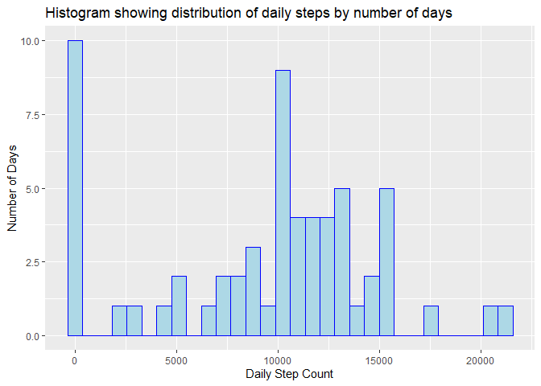
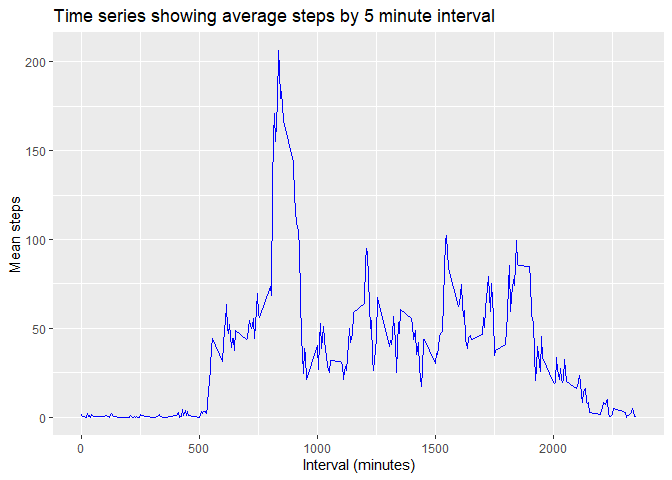
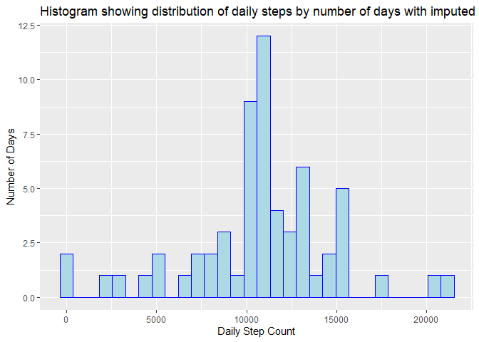
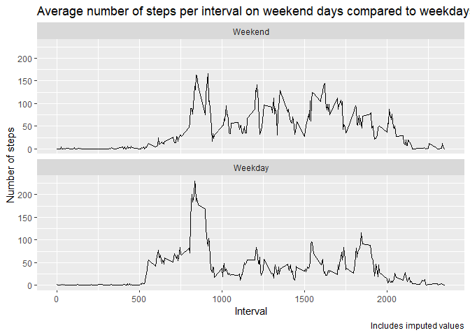

```r
#load libraries
library("dplyr")
```

```
## 
## Attaching package: 'dplyr'
```

```
## The following objects are masked from 'package:stats':
## 
##     filter, lag
```

```
## The following objects are masked from 'package:base':
## 
##     intersect, setdiff, setequal, union
```

```r
library("ggplot2")
library("knitr")
```

## Loading and preprocessing the data

```r
#load data and convert date variable to date format
steps <- read.csv("C:/Users/maril/OneDrive/Documents/R Data Science/Course4/Week1/RepData_PeerAssessment1/activity/activity.csv", header=TRUE, na.strings = "NA")
steps$date<-as.Date(steps$date, format="%Y-%m-%d")
```


## What is mean total number of steps taken per day?

```r
Steps <- steps %>% 
              group_by(date) %>% 
              summarize(dailySteps = sum(steps, na.rm=TRUE))
```


Generate a histogram to show distribution of Daily Step Count

```r
ggplot(Steps, aes(x=dailySteps)) + geom_histogram(color="blue", fill="lightblue") +
  labs(
    title = "Histogram showing distribution of daily steps by number of days",
    x = "Daily Step Count",
    y = "Number of Days"
  )
```

```
## `stat_bin()` using `bins = 30`. Pick better value with `binwidth`.
```

<!-- -->

Mean and Median of the total number of steps taken per day 

```r
summarySteps<-summarize(.data=Steps, meanSteps=mean(dailySteps), medianSteps=median(dailySteps))
summarySteps
```

```
## # A tibble: 1 × 2
##   meanSteps medianSteps
##       <dbl>       <int>
## 1     9354.       10395
```

## What is the average daily activity pattern?

```r
stepIntervals <- steps %>% 
  group_by(interval) %>% 
  summarize(meanSteps = mean(steps, na.rm=TRUE))

ggplot(data=stepIntervals, aes(x=interval, y=meanSteps)) +
  geom_line(na.rm=TRUE, color="blue") +
  labs(
    title = "Time series showing average steps by 5 minute interval",
    x = "Interval (minutes)",
    y = "Mean steps"
  ) 
```

<!-- -->

```r
stepIntervals[which.max(stepIntervals$meanSteps),]
```

```
## # A tibble: 1 × 2
##   interval meanSteps
##      <int>     <dbl>
## 1      835      206.
```

Steps seem to spike between intervals 750-1,000 with the interval 835 having the highest number of average steps, 206

## Imputing missing values

use the mean value rounded to integer to impute values for each 5 minute interval to replace for missing valus for that interval


```r
stepIntervals$imputedSteps <- round(stepIntervals$meanSteps,0)
Steps_imputed <- left_join(x=steps,y=stepIntervals, by="interval" )
Steps_imputed$steps[is.na(Steps_imputed$steps)] <- Steps_imputed$imputedSteps
```

```
## Warning in Steps_imputed$steps[is.na(Steps_imputed$steps)] <-
## Steps_imputed$imputedSteps: number of items to replace is not a multiple of
## replacement length
```

```r
t<-Steps_imputed %>% select(1:4)
Steps_i <- t %>% 
  group_by(date) %>% 
  summarize(dailySteps = sum(steps))
```
Make a histogram of the total number of steps taken each day with imputed values for missing

```r
ggplot(Steps_i, aes(x=dailySteps)) + geom_histogram(color="blue", fill="lightblue") +
  labs(
    title = "Histogram showing distribution of daily steps by number of days with imputed values for NAs",
    x = "Daily Step Count",
    y = "Number of Days"
  )
```

```
## `stat_bin()` using `bins = 30`. Pick better value with `binwidth`.
```

<!-- -->

Calculate and report the mean and median of the total number of steps taken per day (with imputed values)

```r
summarySteps_i<-summarize(.data=Steps_i, meanSteps=mean(dailySteps), medianSteps=median(dailySteps))
summarySteps_i
```

```
## # A tibble: 1 × 2
##   meanSteps medianSteps
##       <dbl>       <dbl>
## 1    10766.       10762
```
Imputing values using the mean value for each interval results in a lot fewer zero values and mean and median values 
for the total step count are much closer to each other.


## Are there differences in activity patterns between weekdays and weekends?

```r
t$weekday <- c("Weekend", "Weekday", "Weekday",    
                   "Weekday", "Weekday", "Weekday",
                   "Weekend")[as.POSIXlt(t$date)$wday + 1]

Steps_days <- t %>% 
  group_by(weekday, interval) %>% 
  summarize(avg_dailySteps = mean(steps))
```

```
## `summarise()` has grouped output by 'weekday'. You can override using the
## `.groups` argument.
```

```r
Steps_days$weekday <- factor(Steps_days$weekday,
                             levels = sort(unique(Steps_days$weekday), decreasing = TRUE))


ggplot(Steps_days, aes(x=interval, y=avg_dailySteps)) +
  geom_line() + 
  xlab("Interval") +
  ylab("Number of steps") +
  facet_wrap(~ weekday, ncol = 1) +
  ggtitle("Average number of steps per interval on weekend days compared to weekdays") +
  labs(caption="Includes imputed values")
```

<!-- -->
  
  It seems that on weekends, there are more steps per day and they are spread out more evenly throughout the day
